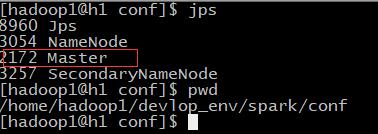

### spark 入门


#### 一. 安装
 - 1 软件版本:
    - hadoop:2.7.5(理应是2.6.x)
    - Spark:1.6.3
    - Scala:2.10.6 
    
 - 2 安装步骤
    - 将spark安装包上传到linux目录上并解压
    - 进入到spark目录的conf目录下:`cd $SPARK_HOME/conf`
    - `cp spark-env.sh.template spark-env.sh`
    - `vim spark-env.sh`
        ```shell
          #配置jdk路径
          export JAVA_HOME=/usr/install/jdk1.7.0_79
          # 配置master节点
          export SPARK_MASTER_IP=h1 
          # 配置master的端口号
          export SPARK_MASTER_PORT=7077
        ```
    - 配置worker节点 `vim slaves`
        ```sbtshell
          h1
          h2
        ```
    -  将整个spark 安装包拷贝到h2,h3节点:
        - 进入到spark安装目录的上一层
        - 拷贝到h2: `scp -r spark hadoop@h2:$PWD`
        - 拷贝到h3: `scp -r spark hadoop@h3:$PWD`
    - 如果需要配置spark的环境变量的话,需要到/etc/profile目录下配置,配置方式如hadoop一样,有`$SPARK_HOME/bin` 和 `$SPARK_HOME/sbin`
#### 二.启动Spark
 - 1 在h1(master)上执行:`$SPARK_HOME/sbin/start-all.sh`,启动结束后,各节点的进程情况:
    - h1:<br/>
       
    - h2:<br/>
       
    - h3:<br/>
          
 - 2 进程启动后的问题思考:
    - h2或者h3上分别只有一个worker进程,难道就只能有一个worker进程吗?<br/>
    &nbsp; &nbsp;&nbsp; &nbsp;理论上每个节点可以启动多个worker进程,但是在实际中往往是一个节点启动一个worker进程就够了.worker的作用就相当于hdfs中的nodemanager,
    负责本节点的资源调度,当接收到一个分析任务后,worker就开辟一块jvm内存空间,
    然后在启动自己的一个子进程**CoarseGrainedExecutorBackend**,来运行开辟的那块空间里边.
    - 在启动worker的时候,在配置文件并没给worker指定端口号,它不需要我们手动去指定端口号,而是自己给自己指定一个临时端口号,等把集群关闭,下次再启动的时候,
    有可能worker自己的端口号又变了.
 - 3 使用webUI查看:`http://h1:8080`<br/>
    
    
#### 三. 案例测试
 - 1 使用$SPARK_HOIME/bin下的spark-submit脚本提交测试任务:
    ```sbtshell
       spark-submit \
       #指定要运行的程序入口
       --class org.apache.spark.examples.SparkPi \
       #指定spark
       --master spark://h1:7077 \
       #指定每个worker节点的运行内存
       --executor-memory 512m \
       #指定运行该程序的总的cpu核数
       --total-executor-cores 2 \
       #指定jar包位置
       /home/hadoop1/devlop_env/spark/lib/spark-examples-1.6.3-hadoop2.6.0.jar \
       #指定运行的参数 
       
    ```
    任务提交后,可到web ui中查看正在进行的一些进程信息,测试结果:`Pi is roughly 3.1416222283244455`
 - 2 可运行spark-shell 脚本进行Scala的交互式编程:
    
    上图中启动的是单机版的spark shell,并且在worker节点不会有新进程启动
    
    启动集群版本的spark-shell:<br/>
    
    ```sbtshell
       ./spark-shell \
       --master spark://h1:7077
       #若不指定memory和cores,也能启动,内部按照默认的进行分配
       --executor-memory 512m \
       --total-executor-cores 2
    ```
    在worker节点会有CoarseGrainedExecutorBackend进程启动.
   
 - 3 在集群版的spark-shell进行wordcount编程,这个案例需要启动hdfs集群.
    - 先准备3个文件上传到hdfs上<br/>
        ```sbtshell
          wc1.txt:
          hello java scala hello
          ---------------------
          wc2.txt:
          hello c++ c# hello
          hello
          --------------------
          hello python c# hello
          hello
          hello
        ```
    - 在集群版的spark-shell中编写如下代码:<br/>
        ```sbtshell
          sc.textFile("hdfs://h1:9000/spark/wc").flatMap(_.split(" ")).map((_,1)).reduceByKey(_+_).collect
        ```
        运行结果如下:
        
#### 四. Idea 中Scala编程测试
 - 1.依旧上面的统计单词个数,Scala代码如下:
    [SparkWordCount.scala](../src/main/scala/com/ljy/day06/SparkWordCount.scala)
    ```scala
    package com.ljy.day06
    
    import org.apache.spark.rdd.RDD
    import org.apache.spark.{SparkConf, SparkContext}
    
    
    object SparkWordCount {
      def main(args: Array[String]): Unit = {
        //创建配置信息
        //setAppName :设置应用程序名称
        //setMaster:设置为班底运行,需要指定线程数
        //其中:"local"是指单线程来运行
        // "local[2]"是指调用两个线程模拟集群
        //"local[*]"是指有多少空闲线程就用多少
        val conf = new SparkConf()
          .setAppName("SparkWordCount")
          .setMaster("local[2]") //本地运行
    
        //创建上下文对象
        val sc: SparkContext = new SparkContext(conf)
        //读取数据
        val lines: RDD[String] = sc.textFile("hdfs://h1:9000/spark/wc")
    
        //将数据切分并压平
        val words: RDD[String] = lines.flatMap(_.split(" "))
    
        //将单词生成元组
        val tuples: RDD[(String, Int)] = words.map((_, 1))
        //将数据聚合
        val reduced: RDD[(String, Int)] = tuples.reduceByKey(_ + _)
    
        //降序排序,true:表示升序,false 降序
        val sorted: RDD[(String, Int)] = reduced.sortBy(_._2, false)
        //collect将RDD转化成数组
        println(sorted.collect().toBuffer)
        //将数据存到hdfs
        sorted.saveAsTextFile("hdfs://h1:9000/spark/wc/out/out_20180531")
        sc.stop()
      }
    }

    ```
 - 2.在本地安装windows版本的hadoop客户端,[下载地址](https://download.csdn.net/download/lljjyy001/10451061)
 - 3.解压后配置好环境变量,变量名为HADOOP_HOME,变量值为解压路径,如我的为`E:\INSTALL\windows-hadoop-bin-2.0.0`
 - 4.点击Idea的运行按钮即可运行,如果最后执行结果返回0,则表示运行成功,可在输出日志中查看到输出结果,也可以到hdfs上如代码中指定的路径下查看执行结果.
 - 5.修改代码,然后打包上传到linux上,使用spark命令执行,
     代码修改的地方如下,注释掉本地运行的设置即可.<br/>
     ```scala
          val conf = new SparkConf()
          .setAppName("SparkWordCount")
          //.setMaster("local[2]") //本地运行
     ```
 - 6 上传到linux的某个目录下.
 - 7 编写执行脚本submit.sh.<br/>
    ```sbtshell
       #!/bin/bash
       #程序入口,运行时参数传入
       export mainClass=$1
       #jar包位置,运行时参数传入
       export jar=$2
       #指定spark-submit的路径
       export spark_submit=/home/hadoop1/devlop_env/spark/bin/spark-submit
       export runMaster=spark://h1:7077
       export memory=512m
       export cores=2
       
       ${spark_submit} --class $mainClass --master $runMaster --executor-me
       mory $memory --total-executor-cores $cores $jar
       
       echo "END"
    ```
 - 8 进入到submit.sh所在目录,执行脚本<br/>
    ```sbtshell
       #我的jar包就传到了submit.sh所在的目录
       ./submit.sh com.ljy.day06.SparkWordCount Day06.jar
    ```
 - 9 运行完后,可到hdfs上查看结果.
 
#### Idea中java代码编程测试.
  - 1.java代码如下[JavaWordCount.java](../src/main/scala/com/ljy/day06/JavaWordCount.java)
    ```java
        package com.ljy.day06;
        
        import org.apache.spark.SparkConf;
        import org.apache.spark.api.java.JavaPairRDD;
        import org.apache.spark.api.java.JavaRDD;
        import org.apache.spark.api.java.JavaSparkContext;
        import org.apache.spark.api.java.function.FlatMapFunction;
        import org.apache.spark.api.java.function.Function2;
        import org.apache.spark.api.java.function.PairFunction;
        import scala.Tuple2;
        
        import java.util.Arrays;
        
        public class JavaWordCount {
            public static void main(String[] args) {
                //创建配置信息类
                /*模板代码*/
                SparkConf conf = new SparkConf()
                        .setAppName("JavaWC");
                        .setMaster("local[*]");
        
                //上传上下文对象
                JavaSparkContext jsc = new JavaSparkContext(conf);
        
                //获取数据
                JavaRDD<String> lines = jsc.textFile("hdfs://h1:9000/spark/wc");
        
                //切分数据
                JavaRDD<String> words = lines.flatMap(new FlatMapFunction<String, String>() {
                    @Override
                    public Iterable<String> call(String s) throws Exception {
                        return Arrays.asList(s.split(" "));
                    }
                });
        
                //把数据生成元组
                JavaPairRDD<String, Integer> tuples = words.mapToPair(new PairFunction<String, String, Integer>() {
                    @Override
                    public Tuple2<String, Integer> call(String s) throws Exception {
                        return new Tuple2<>(s, 1);
                    }
                });
        
                //聚合数据
                JavaPairRDD<String, Integer> reduced = tuples.reduceByKey(new Function2<Integer, Integer, Integer>() {
                    @Override
                    public Integer call(Integer v1, Integer v2) throws Exception {
                        return v1 + v2;
                    }
                });
        
                //颠倒<key,value>---> <value,key>
                JavaPairRDD<Integer, String> reversed = reduced.mapToPair(new PairFunction<Tuple2<String, Integer>, Integer, String>() {
                    @Override
                    public Tuple2<Integer, String> call(Tuple2<String, Integer> tup) throws Exception {
                        return tup.swap();
                    }
                }/*new Tuple2<>(keyvalue._2, keyvalue._1)*/);
        
                //排序,false-->降序
                JavaPairRDD<Integer, String> sorted = reversed.sortByKey(false);
                //反转数据
                JavaPairRDD<String, Integer> res = sorted.mapToPair(new PairFunction<Tuple2<Integer, String>, String, Integer>() {
                    @Override
                    public Tuple2<String, Integer> call(Tuple2<Integer, String> tup) throws Exception {
                        return tup.swap();
                    }
                });
        
                System.out.println(res.collect());
        
                res.saveAsTextFile("hdfs://h1:9000/spark/wc/out/out_20180531-java");
                jsc.stop();
        
            }
        }

    ```
  - 2 配置上面所说的环境变量后,点击Idea的运行按钮即可运行.
  - 3 修改代码,按照四中的方式打包上传到linux,并用上面的submit.sh脚本运行jar包即可,修改的代码:
    ```java
    SparkConf conf = new SparkConf()
               .setAppName("JavaWC");
               .setMaster("local[*]");
    ```
 