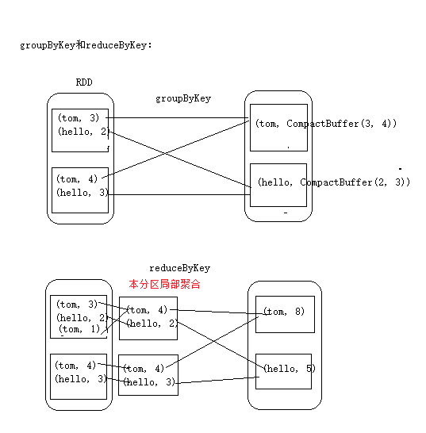
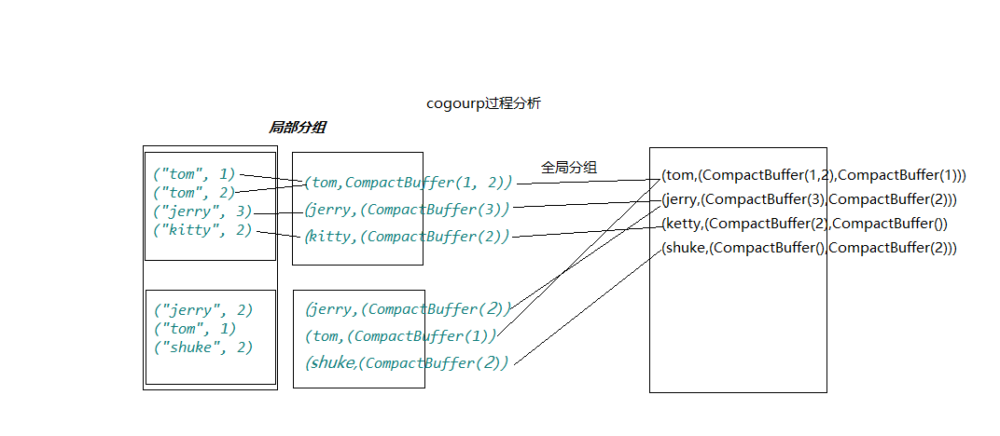

#### RDD概述
 - 什么是RDD?<br/>
    **RDD**(ResilientDistributedDataset) 分布式数据集,
    是Spark中最基本的数据抽象,它代表一个**不可变**,**可分割**,**里面的元素可并行计算**的集合.RDD具有
    数据流模型的特点,自动容错,位置感知性调度和可伸缩性,RDD允许用户在执行多个查询的时显示的将工作集缓存到内存中,
    后续的查询能够重用工作集,这极大的提升了查询速度
 
 - RDD的属性
    - 一组分片(partition),即数据集的基本组成单位.对于RDD来说,每一个分片都会被一个计算任务处理,
      并决定并行计算的粒度.用户可以在创建RDD时指定RDD的分片个数,如果没有指定,那么就会采用默认值.
      默认值就是程序所分配到的COUR的核数.
    
    - 一个计算每个分区的函数.Spark中RDD的计算是以分片为单位的,每个RDD都会实现compute函数以达到
      这个目的.compute函数会对迭代器进行复合,不需要保存每次计算的结果.
      
    - RDD之间的依存关系.RDD的每次转换都会生成一个新的RDD,所以RDD之间就会形成类似于流水一样的前后依赖关系,
      在部分分区数据丢失时,Spark可以通过这个依赖关系重新计算丢失的分区数据,而不是对RDD的所有分区进行重新计算.
    
    - 一个Partitioner,即RDD的分片函数.当前Spark中实现两种类型的分片函数,一个是基于哈希的HashPartitioner,
      另一个是基于范围的RangePartitioner,只有对应key-value的RDD,才会有Partitioner,非key-value的RDD的
      Partitioner的值是None,Partitioner函数不但决定了RDD本身的分片数量,也决定了parent RDD Shuffle输出时的分片数量.
    
    - 一个列表,存储存取每个Partition的优先位置,对于一个HDFS文件来说,这个列表保存的就是每个Partition所在的块的位置.
      按照"移动数据不如移动计算"的理念,Spark在进行任务调度的时候,会尽可能的将计算任务分配到其所要处理数据块的存储位置.
      
 - RDD创建的两种方式.
    - 由一个已经存在的Scala集合创建.
      ```scala
        val rdd = sc.parallelize(Array(1,2,3,4,5,6,7,8))
      ```
      或者创建的时候指定分区.
      ```scala
        val rdd = sc.parallelize(Array(1,2,3,4,5,6,7,8),3)
      ```
    - 有外部的存储系统的数据集创建,包括本地的文件系统,还有所有Hadoop支持的数据集,比如HDFS,Cassandra,HBase等
      ```scala
        val rdd = sc.textFile("hdfs://h1:9000/spark/wc")
      ```
 
 - RDD编程API
    - Transformation<br/>
      RDD中的所有转换都是延迟加载的,也就是说,他们并不会直接计算结果.相反的,他们只是记住这些应用
      到基础数据集(例如一个文件)上的转换动作,只有当发生一个要求返回结果给Driver的动作时,这些转换才会真正的运行.
      这种设计让Spark更加有效率的运行
      
    - 常用的Transformation:<br/>
    
       - **map(func):**<br/>
         返回一个新的RDD,该RDD有每一个输入元素经过fun函数转化后组成
         
       - **filter(func):**<br/>
         返回一个新的RDD，该RDD由经过func函数计算后返回值为true的输入元素组成
       
       - **flatMap(func):**<br/>
         类似于map，但是每一个输入元素可以被映射为0或多个输出元素（所以func应该返回一个序列，而不是单一元素）
       
       - **mapPartitions(func):**<br/>
         类似于map，但独立地在RDD的每一个分片上运行，因此在类型为T的RDD上运行时，func的函数类型必须是Iterator[T] => Iterator[U]
         
       - **mapPartitionsWithIndex(func):**<br/>
         类似于mapPartitions，但func带有一个整数参数表示分片的索引值，因此在类型为T的RDD上运行时，func的函数类型必须是
         (Int, Iterator[T]) => Iterator[U]
       
       - **sample(withReplacement, fraction, seed):**<br/>
         根据fraction指定的比例对数据进行采样，可以选择是否使用随机数进行替换，seed用于指定随机数生成器种子
         
       - **union(otherDataset):**<br/>
         对源RDD和参数RDD求并集后返回一个新的RDD
       
       - **intersection(otherDataset):**<br/>
         对源RDD和参数RDD求交集后返回一个新的RDD
       
       - **distinct([numTasks])):**<br/>
         对源RDD进行去重后返回一个新的RDD
       
       - **groupByKey([numTasks]):**<br/>
         在一个(K,V)的RDD上调用，返回一个(K, Iterator[V])的RDD
       
       - **reduceByKey(func, [numTasks]):**<br/>
         在一个(K,V)的RDD上调用，返回一个(K,V)的RDD，使用指定的reduce函数，将相同key的值聚合到一起，与groupByKey类似，reduce任务的个数可以通过第二个可选的参数来设置
       
       - **aggregateByKey(zeroValue)(seqOp, combOp, [numTasks])**:<br/>
       
       - **sortByKey([ascending], [numTasks]):**<br/>
         在一个(K,V)的RDD上调用，K必须实现Ordered接口，返回一个按照key进行排序的(K,V)的RDD
         
       - **sortBy(func,[ascending], [numTasks]):**<br/>
         与sortByKey类似，但是更灵活  
       
       - **join(otherDataset, [numTasks]):**<br/>
         在类型为(K,V)和(K,W)的RDD上调用，返回一个相同key对应的所有元素对在一起的(K,(V,W))的RDD
       
       - **cogroup(otherDataset, [numTasks]):**<br/>
         在类型为(K,V)和(K,W)的RDD上调用，返回一个(K,(Iterable<V>,Iterable<W>))类型的RDD
         笛卡尔积
       
       - **pipe(command, [envVars]):**<br/>
       
       - **coalesce(numPartitions):** <br/>
       
       - **repartition(numPartitions):**<br/>
       
       - **repartitionAndSortWithinPartitions(partitioner):**<br/>
       
    - 常用的Action
    
       - **reduce(func):**<br/>
         通过func函数聚集RDD中的所有元素，这个功能必须是可交换且可并联的
        
       - **collect():**<br/>
         在驱动程序中，以数组的形式返回数据集的所有元素
       
       - **count():**<br/>
         返回RDD的元素个数
       
       - **first():**<br/>
         返回RDD的第一个元素（类似于take(1)）
       
       - **take(n):**<br/>
         返回一个由数据集的前n个元素组成的数组
       
       - **takeSample(withReplacement,num, [seed]):**<br/>
         返回一个数组，该数组由从数据集中随机采样的num个元素组成，可以选择是否用随机数替换不足的部分，seed用于指定随机数生成器种子
       
       - **takeOrdered(n, [ordering]):**<br/>
         takeOrdered和top类似，只不过以和top相反的顺序返回元素
       
       - **saveAsTextFile(path):**<br/>
         将数据集的元素以textfile的形式保存到HDFS文件系统或者其他支持的文件系统，对于每个元素，Spark将会调用toString方法，将它装换为文件中的文本
         
       - **saveAsSequenceFile(path):**<br/>
         将数据集中的元素以Hadoop sequencefile的格式保存到指定的目录下，可以使HDFS或者其他Hadoop支持的文件系统。
         
       - **saveAsObjectFile(path):**<br/>
       
       - **countByKey():**<br/>
         针对(K,V)类型的RDD，返回一个(K,Int)的map，表示每一个key对应的元素个数。
       
       - **foreach(func):**<br/>
         在数据集的每一个元素上，运行函数func进行更新。
    
    
 - 练习
    - 练习1
       ```scala
         //通过并行化生成rdd
         val rdd1 = sc.parallelize(List(5, 6, 4, 7, 3, 8, 2, 9, 1, 10))
         //对rdd1里的每一个元素乘2然后排序
         val rdd2 = rdd1.map(_ * 2).sortBy(x => x, true)
         //过滤出大于等于十的元素
         val rdd3 = rdd2.filter(_ >= 10)
         //将元素以数组的方式在客户端显示
         rdd3.collect
    
       ```
   
   - 练习2
       ```scala
         val rdd1 = sc.parallelize(Array("a b c", "d e f", "h i j"))
         //将rdd1里面的每一个元素先切分在压平
         val rdd2 = rdd1.flatMap(_.split(' '))
         rdd2.collect
        
         //来个复杂的：
         val rdd1 = sc.parallelize(List(List("a b c", "a b b"), List("e f g", "a f g"), List("h i j", "a a b")))
         //将rdd1里面的每一个元素先切分并压平
         val rdd2 = rdd1.flatMap(_.flatMap(_.split(" ")))
         rdd2.collect
    
       ```
   - 练习3
       ```scala
        val rdd1 = sc.parallelize(List(5, 6, 4, 3))
        val rdd2 = sc.parallelize(List(1, 2, 3, 4))
        //求并集
        val rdd3 = rdd1.union(rdd2)
        
        //求交集
        val rdd4 = rdd1.intersection(rdd2)
        //去重
        rdd3.distinct.collect
        rdd4.collect
    
       ```
   - 练习4
        ```scala
        val rdd1 = sc.parallelize(List(("tom", 1), ("jerry", 3), ("kitty", 2)))
        val rdd2 = sc.parallelize(List(("jerry", 2), ("tom", 1), ("shuke", 2)))
        //求join
        val rdd3 = rdd1.join(rdd2)
        rdd3.collect
        //求左连接和右连接
        val rdd3 = rdd1.leftOuterJoin(rdd2)
        rdd3.collect
        val rdd3 = rdd1.rightOuterJoin(rdd2)
        rdd3.collect
        //求并集
        val rdd4 = rdd1 union rdd2
        //按key进行分组
        rdd4.groupByKey()
        rdd4.collect
   
        //分别用groupByKey和reduceByKey实现单词计数
        val rdd3 = rdd1 union rdd2
        rdd3.groupByKey().mapValues(_.sum).collect
        rdd3.reduceByKey(_+_).collect
    
        ```
   - 比较groupByKey()和reduceByKey()的区别
   
        
        
        由图可以看到groupByKey是先根据key进行重新分区,然后还需要其他算子参与聚合,
        而reduceByKey先在本分区内聚合进行局部的聚合,然后在全局聚合,整个过程都由spark自动完成,包括最后的聚合.
   
   - 练习5
        ```scala
         val rdd1 = sc.parallelize(List(("tom", 1), ("tom", 2), ("jerry", 3), ("kitty", 2)))
         val rdd2 = sc.parallelize(List(("jerry", 2), ("tom", 1), ("shuke", 2)))
         //cogroup
         val rdd3 = rdd1.cogroup(rdd2)
         //注意cogroup与groupByKey的区别
         rdd3.collect
        ```
        运行结果:
        ```scala
         //groupByKey
         scala> val rdd3 = rdd1.union(rdd2).groupByKey()
         rdd3: org.apache.spark.rdd.RDD[(String, Iterable[Int])] = ShuffledRDD[50] at groupByKey at <console>:31
         
         scala> rdd3.collect
         res25: Array[(String, Iterable[Int])] = Array((tom,CompactBuffer(1, 2, 1)), (jerry,CompactBuffer(3, 2)), (shuke,CompactBuffer(2)), (kitty,CompactBuffer(2)))

        //cogroup的结果
        scala> rdd1.cogroup(rdd2).collect
        res26: Array[(String, (Iterable[Int], Iterable[Int]))] = Array((tom,(CompactBuffer(1, 2),CompactBuffer(1))), (jerry,(CompactBuffer(3),CompactBuffer(2))), (shuke,(CompactBuffer(),CompactBuffer(2))), (kitty,(CompactBuffer(2),CompactBuffer())))
        ```
        由运行结果可以看出,groupByKey是先根据key进行重新分区,而cogroup是先根据Key进行局部分组,然后再key进行的重新分区
        
        
        
   - 练习6
        ```scala
         val rdd1 = sc.parallelize(List(1, 2, 3, 4, 5))
         //reduce聚合,属于action操作
         val rdd2 = rdd1.reduce(_ + _)  
         val rdd3 = rdd1.sum()

        ```
   - 练习7
        ```scala
         val rdd1 = sc.parallelize(List(("tom", 1), ("jerry", 3), ("kitty", 2),  ("shuke", 1)))
         val rdd2 = sc.parallelize(List(("jerry", 2), ("tom", 3), ("shuke", 2), ("kitty", 5)))
         
         //求并集
        val rdd3 = rdd1.union(rdd2)
        //按key进行单词计数,并按降序排序
        rdd3.reduceByKey(_+_).map(x=>(x._2,x._1)).sortByKey(false).map(x=>(x._2,x._1))
        //注意:调用sortByKey的key-value中,K必须实现Ordered接口
         
        ```  

 - 其他操作
    - 查看分区以及自定RDD的时候指定分区数 <br/>
        > 1. 定义RDD <br/>
            `val rdd1 = sc.parallelize(List(1,2,3,4,5,6,7,8))`
        > 2. 查看分区数:<br/>
            `rdd.partitions.length`
        > 3. 定义RDD,并指定分区数<br/>
            `val rdd1 = sc.parallelize(List(1,2,3,4,5,6,7,8),2)`
        > 4. 查看分区:<br/>
            `rdd1.partitions.length`
    - 读取HDFS上的文件,并查看分区
        > 1. 根据hdfs上的文件生成RDD<br/>
            `val rdd1 = sc.textFile("hdfs://h1:9000/spark/wc")` <br/>
            # 我spark/wc 目录下有3个文件,分别是wc1.txt,wc2.txt,wc3.txt
        > 2. 查看分区:<br/>
            `rdd1.partitions.length`<br/>
            `scala> rdd1.partitions.length`<br/>
            `res38: Int = 3`<br/>
            #结果是三个分区
        > 3. 尝试根据hdfs上的文件生成RDD的时候,指定分区数:<br/>
            `val rdd1 = sc.textFile("hdfs://h1:9000/spark/wc",1)` <br/>
        > 4. 查看分区的结果:<br/>
            `rdd1.partitions.length`<br/>
            `scala> rdd1.partitions.length`<br/>
            `res38: Int = 3`<br/>
            #结果并没有改变,依旧是3个分区
        > 5. 尝试根据hdfs上的文件生成RDD的时候,指定 分区数>文件数<br/>
            `val rdd1 = sc.textFile("hdfs://h1:9000/spark/wc",4)` <br/>
        > 6. 查看分区的结果:<br/>
             `rdd1.partitions.length`<br/>
             `scala> rdd1.partitions.length`<br/>
             `res38: Int = 6`<br/>
             #结果变成了6个分区
        > 7. 以上为什么会有这样的分区原因待查明.接下来在发生Shuffle的时在指定分区:<br/>
              `val rdd1 = sc.textFile("hdfs://h1:9000/spark/wc",4)`<br/>
              `val rdd2 = rdd1.flatMap(_.split(" ")).map(x=>(x,1)).reduceByKey(_+_,4)` //reduceByKey的时候指定分区数 <br/>
              `rdd2.aprtitions.length`<br/>
              `scala> rdd2.partitions.length`<br/>
              `res41: Int = 4`<br/>
    
    - mapPartitions:<br/>      
      ```scala
        val rdd1 = sc.parallelize(Array(1,2,3,4,5,6,7,8),2)
        
        scala> rdd1.partitions.length
        res43: Int = 2
          
        //将每个分区的元素*10
        //第一个_代表每一个分区,第二个_代表分割分区里面的每一个元素
        scala> rdd1.mapPartitions(_.map(_*10)).collect
        res46: Array[Int] = Array(10, 20, 30, 40, 50, 60, 70, 80)
      ```
        **map和mapPartitions的区别**<br/>
        **map:得到的是每一个元素**<br/>
        **mapPartitions:得到的每一个分区**<br/>
    
    - mapWith:<br/> 
        参数列表:<br/>
        (constructA: Int => A,//每个分区的索引<br/>
        preservesPartitioning: Boolean = false)//可选参数,是否保存父RDD的分区信息<br/>
        (f: (T, A) => Seq[U]):是一个函数:T:每次循环得到的RDD的元素,第一个参数列表结果的返回<br/>
        
        ```scala
         val rdd1 = sc.parallelize(Array(1,2,3,4,5,6,7,8),2)
         rdd1.mapWith(partition_index=>partition_index)((item,partition_index)=>partition_index).collect
            res47: Array[Int] = Array(0, 0, 0, 0, 1, 1, 1, 1)
        ```
    - flatMapWith:<br/>
        参数列表:<br/>
        constructA: Int => A, //分区索引 <br/>
        preservesPartitioning: Boolean = false) 是否保存父RDD的信息<br/>
        (f: (T, A) => Seq[U]): <br/>
        ```scala
          scala> rdd1.flatMapWith(partition_index=>partition_index)((item,partition_index)=>List((partition_index,item))).collect
          warning: there were 1 deprecation warning(s); re-run with -deprecation for details
          res50: Array[(Int, Int)] = Array((0,1), (0,2), (0,3), (0,4), (1,5), (1,6), (1,7), (1,8))
          
        ```
    - mapPartitionsWithIndex:<br/>
        参数列表:<br/>
        (f: (Int, 分区索引<br/>
            Iterator[T]) 分区信息<br/>
            => Iterator[U],<br/>
         preservesPartitioning: Boolean = false)
        ```scala
          val func = (index:Int,iter:Iterator[Int])=>{
            iter.toList.map(x=>"[partID:"+index+",val:"+x+"]").iterator
          }
          rdd1.mapPartitionsWithIndex(func).collect
          res51: Array[String] = Array([partID:0,val:1], [partID:0,val:2], [partID:0,val:3], [partID:0,val:4], [partID:1,val:5], [partID:1,val:6], [partID:1,val:7], [partID:1,val:8])
    
        ``` 
    
    - aggregate:<br/>
        ```scala
        
          // 初始值 分区局部计算max值
          // 分区1的元素有1,2,3,4===>0与1求最大值-->1  ===>1与2求最大值--->2  ===>2与3求最大值---->3   ===>3与4求最大值---->4
          // 所以第一个分区得到的值是4
          // 分区2的元素有5,6,7,8
          // 0先于6求最大值,然后得到的值在和下一个值求最大值,最后得到分区2的值
          // 最后将两个分区的值累加,---> _+_
          // max(_,_) 第一个_表示上一次计算的结果值,第二个_表示当前的元素
          scala> rdd1.aggregate(0)(math.max(_,_),_+_)
          res52: Int = 12
        ```    
        **注意,由于每个分区计算完成的顺序有可能不一样,<br/>
        所以如果是字符串的话,可能会有多种可能的结果**
        
        ```scala
          val rdd3 = sc.parallelize(List("12","23","345","4567"),2)
          rdd3.aggregate("")((x,y) => math.max(x.length, y.length).toString, (x,y) => x + y)
          // 分析
          // 第一个分区 "12","34"
          // 第一个分区的计算结果  2
          // 第二个分区 "345","4567"
          // 第二个分区的计算结果是 4
          // 如果第一个分区先计算完成,则是"2"+"4" 最后聚合的结果是24
          // 如果是第二个分区先计算完成,则是 "4"+"2" 最后聚合的结果是42
    
        ```
    - aggregateByKey:<br/>
        ```scala
          val rdd1 = sc.parallelize(List( ("mouse", 2),("cat",2), ("cat", 5), ("mouse", 4),("cat", 12), ("dog", 12)), 2)
          rdd1.aggregateByKey(0)(math.max(_,_),_+_).collect
          // 分析
          // 第0个分区 ("mouse", 2),("cat",2), ("cat", 5),
          // 第1个分区 ("mouse", 4),("cat", 12), ("dog", 12)
          // bykey会根据key在分区里面又进行分组,所以第一个分区的第一组是("mouse", 2),第二组是("cat",2), ("cat", 5)
          // 0与第0个分区的第一个分组进行比较,0<2==>第一个组最后结果是("mouse", 2)
          // 0与第0个分区的第二各分组进行比较,0<2 ==>2 2<5===>5 所以第二组的最后结果是("cat", 5)
          // 所以第0个分区的最后结果是("mouse", 2),("cat", 5)
          
          // 第1个分区分组情况:第一组:("mouse", 4)  第二组: ("cat", 12)  第三组 ("dog", 12)
          // 0与第1个分区的第一组相比,最后结果是("mouse", 4)
          // 0与第1个分区的第二组相比,最后结果是("cat", 12)
          // 0与第1个分区的第三组相比,最后结果是("dog", 12)
          // 所以第1个分区的最后结果是("mouse", 4),("cat", 12), ("dog", 12)
          
          // 最后聚合,相同key的元组的_2相加,所以最后结果聚合的结果是("mouse", 6),("cat", 17), ("dog", 12)
          scala> rdd1.aggregateByKey(0)(math.max(_,_),_+_).collect
          res61: Array[(String, Int)] = Array((dog,12), (cat,17), (mouse,6))
        ----------------------------------------------------------------------------
          rdd1.aggregateByKey(100)(math.max(_,_),_+_).collect
          // 分析:
          // 第0个分区 ("mouse", 2),("cat",2), ("cat", 5),
          // 第1个分区 ("mouse", 4),("cat", 12), ("dog", 12)
          // bykey会根据key在分区里面又进行分组,所以第一个分区的第一组是("mouse", 2),第二组是("cat",2), ("cat", 5)
          // 100与第0个分区的第一个分组进行比较,100>2==>第一个组最后结果是("mouse", 100)
          // 100与第0个分区的第二各分组进行比较,100>2 ==>100 100>5===>100 所以第二组的最后结果是("cat", 100)
          // 所以第0个分区的最后结果是("mouse", 100),("cat", 100)
          
          // 第1个分区分组情况:第一组:("mouse", 4)  第二组: ("cat", 12)  第三组 ("dog", 12)
          // 100与第1个分区的第一组相比,最后结果是("mouse", 100)
          // 100与第1个分区的第二组相比,最后结果是("cat", 100)
          // 100与第1个分区的第三组相比,最后结果是("dog", 100)
          // 所以第1个分区的最后结果是("mouse", 100),("cat", 100), ("dog", 100)
          // 最后聚合,相同key的元组的_2相加,所以最后结果聚合的结果是("mouse", 200),("cat", 200), ("dog", 100)
          scala> rdd1.aggregateByKey(100)(math.max(_,_),_+_).collect
          res62: Array[(String, Int)] = Array((dog,100), (cat,200), (mouse,200))
      
        ```
        
        aggregateByKey实现单词计数:
        ```scala
          val rdd1 = sc.parallelize(List( ("mouse", 1),("cat",1), ("cat", 1), ("mouse", 1),("cat", 1), ("dog", 1)), 2)
          scala> rdd1.aggregateByKey(0)(_+_,_+_).collect
          res64: Array[(String, Int)] = Array((dog,1), (cat,3), (mouse,2))
          //原理同上
        ```
    
    - combineByKey:<br/>
        ```scala
         def combineByKey[C](createCombiner: (V) => C,  
                             mergeValue: (C, V) => C,   
                             mergeCombiners: (C, C) => C): RD
                  
         //createCombiner: combineByKey() 会遍历分区中的所有元素，因此每个元素的键要么还没有遇到过，要么就 
         //和之前的某个元素的键相同。如果这是一个新的元素， combineByKey() 会使用一个叫作 createCombiner() 的函数来创建 
         //那个键对应的累加器的初始值
         // 
         //mergeValue: 如果这是一个在处理当前分区之前已经遇到的键， 它会使用 mergeValue() 方法将该键的累加器对应的当前值与这个新的值进行合并
         //
         //mergeCombiners: 由于每个分区都是独立处理的， 因此对于同一个键可以有多个累加器。如果有两个或者更 
         //多的分区都有对应同一个键的累加器， 就需要使用用户提供的 mergeCombiners() 方法将各 
         //个分区的结果进行合并。
  
  
          val rdd1 = sc.textFile("hdfs://h1:9000/spark/wc").flatMap(_.split(" ")).map((_,1))
          rdd1.collect
          res65: Array[(String, Int)] = Array((hello,1), (java,1), (scala,1), (hello,1), (hello,1), (c++,1), (c#,1), (hello,1), (hello,1), (hello,1), (python,1), (c#,1), (hello,1), (hello,1), (hello,1))
          
          rdd1.combineByKey(x=>x,(x:Int,y:Int)=>x+y,(m:Int,n:Int)=> m+n).collect
          res67: Array[(String, Int)] = Array((scala,1), (python,1), (hello,9), (java,1), (c#,2), (c++,1))
          
        //分析:
        //rdd1.combineByKey(x=>x+10,(x:Int,y:Int)=>x+y,(m:Int,n:Int)=> m+n).collect
        //    第一个分区的元素
        //    hello java scala hello
        //    ---------------------
        //    第二个分区的元素
        //    hello c++ c# hello hello
        //    --------------------
        //    第三个分区的元素
        //    hello python c# hello hello hello
        
        //计算第一个分区:
        //hello 是一个新建,createCombiner()创建一个以10为初始值的累加器进行累加---->(hello,10+1)-->(hello,11)
        //java 是一个新建,createCombiner()创建一个以10为初始值的累加器进行累加---->(java,10+1)-->(java,11)
        //scala 是一个新建,createCombiner()创建一个以10为初始值的累加器进行累加---->(scala,10+1)-->(scala,11)
        //hello 不再是一个新值,会在原来的累加器上进行累加 (hello,11+1)-->(hello,12)
        
        //计算第二个分区:
        //hello 是一个新建,createCombiner()创建一个以10为初始值的累加器进行累加---->(hello,10+1)-->(hello,11)
        //c++ 是一个新建,createCombiner()创建一个以10为初始值的累加器进行累加---->(c++,10+1)-->(c++,11)
        //c# 是一个新建,createCombiner()创建一个以10为初始值的累加器进行累加---->(c#,10+1)-->(c#,11)
        //hello 不再是一个新值,会在原来的累加器上进行累加 (hello,11+1)-->(hello,12)
        //hello 不再是一个新值,会在原来的累加器上进行累加 (hello,12+1)-->(hello,13)
        
        //计算第三个分区:
        //hello 是一个新建,createCombiner()创建一个以10为初始值的累加器进行累加---->(hello,10+1)-->(hello,11)
        //python 是一个新建,createCombiner()创建一个以10为初始值的累加器进行累加---->(python,10+1)-->(python,11)
        //c# 是一个新建,createCombiner()创建一个以10为初始值的累加器进行累加---->(c#,10+1)-->(c#,11)
        //hello 不再是一个新值,会在原来的累加器上进行累加 (hello,11+1)-->(hello,12)
        //hello 不再是一个新值,会在原来的累加器上进行累加 (hello,12+1)-->(hello,13)
        //hello 不再是一个新值,会在原来的累加器上进行累加 (hello,13)-->(hello,14)
        
        //三个分区进行聚合:
        // (hello,12+13+14),(java,11),(scala,11),(c++,11),(c#,11+11),(python,11)
        //===>
        //(hello,39),(java,11),(scala,11),(c++,11),(c#,22),(python,11)
        
        scala> rdd1.combineByKey(x=>x+10,(x:Int,y:Int)=>x+y,(m:Int,n:Int)=> m+n).collect
        res68: Array[(String, Int)] = Array((scala,11), (python,11), (hello,39), (java,11), (c#,22), (c++,11))
  
        ```
        ```scala
          
          val rdd1 = sc.parallelize(List("dog","cat","gnu","salmon","rabbit","turkey","wolf","bear","bee"), 3)
          val rdd2 = sc.parallelize(List(1,1,2,2,2,1,2,2,2), 3)
          val rdd3 = rdd2.zip(rdd1)
          
          scala> rdd3.collect
          res69: Array[(Int, String)] = Array((1,dog), (1,cat), (2,gnu), (2,salmon), (2,rabbit), (1,turkey), (2,wolf), (2,bear), (2,bee))
          
          val rdd4 = rdd3.combineByKey(List(_), (x: List[String], y: String) => x :+ y, (m: List[String], n: List[String]) => m ++ n)
          
          //分析:
          //    List(_):遍历每一个元素,为不同的key创建各自的list累加器
          //    (x: List[String], y: String) => x :+ y 把相同key的元素放在同一个累加器中
          //    (m: List[String], n: List[String]) => m ++ n :将相同key的元素(1,list)的list进行相加
          
          scala> rdd4.collect
          res1: Array[(Int, List[String])] = Array((1,List(dog, cat, turkey)), (2,List(gnu, salmon, rabbit, wolf, bear, bee)))
    
        ```
        
    - countByKey:<br/>
        ```scala
          val rdd1 = sc.parallelize(List(("a", 1), ("b", 2), ("b", 2), ("c", 2), ("c", 1)))
          scala> rdd1.countByKey
          res2: scala.collection.Map[String,Long] = Map(a -> 1, b -> 2, c -> 2)
          
          //根据key出现的次数进行统计
          //a 出现了1次,b出现了两次,c出现了两次
          
          scala.collection.Map[(String, Int),Long] = Map((b,2) -> 2, (c,2) -> 1, (a,1) -> 1, (c,1) -> 1)
          //根据value出现的次数进行计数,注意这里不能单独将元组的value作为最后结果的key,需要依赖于元组的key
          
        ```
    
    - filterByRange():<br/>
        ```scala
          val rdd1 = sc.parallelize(List(("e", 5), ("c", 3), ("d", 4), ("c", 2), ("a", 1)))
          val rdd2 = rdd1.filterByRange("c", "d")
          
          scala> rdd2.collect
          res1: Array[(String, Int)] = Array((c,3), (d,4), (c,2))
          
          scala> rdd1.filterByRange("c", "e").collect
          res2: Array[(String, Int)] = Array((e,5), (c,3), (d,4), (c,2))
        ```
    - flatMapValues:<br/>
        ```scala
          val rdd3 = sc.parallelize(List(("a", "1 2"), ("b", "3 4")))
          scala> rdd3.flatMapValues(_.split(" ")).collect
          res4: Array[(String, String)] = Array((a,1), (a,2), (b,3), (b,4))
        ```
    - foldByKey:<br/>
        ```scala
          val rdd1 = sc.parallelize(List("dog", "wolf", "cat", "bear"), 2)
          val rdd2 = rdd1.map(x => (x.length, x))
          val rdd3 = rdd2.foldByKey("")(_+_)
          scala> rdd3.collect
          res6: Array[(Int, String)] = Array((4,wolfbear), (3,dogcat))
          
          val rdd = sc.textFile("hdfs://h1:9000/spark/wc").flatMap(_.split(" ")).map((_, 1))
          rdd.foldByKey(0)(_+_).collect
          scala> Array[(String, Int)] = Array((scala,1), (python,1), (hello,9), (java,1), (c#,2), (c++,1))

        ```
    - foreachPartition:<br/>
        ```scala
         val rdd1 = sc.parallelize(List(1, 2, 3, 4, 5, 6, 7, 8, 9), 3)
         scala> rdd1.foreachPartition(x=>println(x.reduce(_+_)))
         6
         15
         24
        ```
    - keyBy:<br/>
        ```scala
          val rdd1 = sc.parallelize(List("dog", "salmon", "salmon", "rat", "elephant"), 3)
          scala> rdd1.keyBy(_.length).collect
          res1: Array[(Int, String)] = Array((3,dog), (6,salmon), (6,salmon), (3,rat), (8,elephant))
        ```
    - keys&values:<br/>
       ```scala
          val rdd1 = sc.parallelize(List("dog", "tiger", "lion", "cat", "panther", "eagle"), 2)
          val rdd2 = rdd1.map(x => (x.length, x))
          scala> rdd2.keys.collect
          res4: Array[Int] = Array(3, 5, 4, 3, 7, 5)
          
          scala> rdd2.values.collect
          res5: Array[String] = Array(dog, tiger, lion, cat, panther, eagle)
    
       ```  
    - checkpoint:<br/>
        后续补上
    
    - repartition: <br/>
        ```scala
          val rdd1 = sc.parallelize(1 to 10,10)
          scala> rdd1.partitions.length
          res6: Int = 10
          
          val rdd2 = rdd1.repartition(2)
          scala> rdd2.partitions.length
          res8: Int = 2
     
          val rdd2 = rdd1.repartition(20)
          scala> rdd2.partitions.length
          res8: Int = 20
    
        ```
    -  coalesce:<br/>
        ```scala
         val rdd1 = sc.parallelize(1 to 10,3)
         val rdd2 = rdd1.coalesce(2)
         scala> rdd2.partitions.length
         res10: Int = 2
         
        // 多变少不是发生shuffle,可以成功
         val rdd2 = rdd1.coalesce(4)
         scala> rdd2.partitions.length
         res10: Int = 3  //失败了,没有重新分区成功
        
        val rdd2 = rdd1.coalesce(4,true)
        scala> rdd2.partitions.length
        res10: Int = 4  //成功了,少变多需要手动指定发生shuffle
        ```
    - partitionBy:<br/>
        ```scala
          val rdd1 = sc.parallelize(List(("jerry",2),("tom",3),("shuke",4)),3)
          val rdd2 = rdd1.partitionBy(new org.apache.spark.HashPartitioner(4))
          scala> rdd2.partitions.length
          res14: Int = 4
          
          val rdd2 = rdd1.partitionBy(new org.apache.spark.HashPartitioner(2))
          scala> rdd2.partitions.length
          res14: Int = 2
        ```
        
    - collectAsMap:<br/>
        ```scala
          val rdd = sc.parallelize(List(("a", 1), ("b", 2)))
          scala> rdd.collectAsMap
          res15: scala.collection.Map[String,Int] = Map(b -> 2, a -> 1)
        ```
        