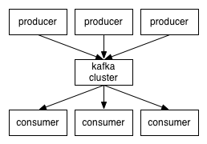

### Kafka
   - 在流计算中,kafka是一般用来缓存数据,Storm通过消费Kafka的数据进行计算
   
   - kafka三个重要的属性:解耦,异步和并发
   
   - Kafka整体结构图:<br/>
    
    
   - Kafka名词解释和工作方式
   
        - Producer:消息生产者，就是向kafka broker发消息的客户端
        - Consumer:消息消费者，向kafka broker取消息的客户端     
        - Topic:我们可以理解为一个队列
        - Consumer Group （CG）: 这是kafka用来实现一个topic消息的广播（发给所有的consumer）
            和单播（发给任意一个consumer）的手段。一个topic可以有多个CG。
            topic的消息会复制（不是真的复制，是概念上的）到所有的CG，
            但每个partion只会把消息发给该CG中的一个consumer。如果需要实现广播，
            只要每个consumer有一个独立的CG就可以了。要实现单播只要所有的consumer在同一个CG。
            用CG还可以将consumer进行自由的分组而不需要多次发送消息到不同的topic。
        - Broker :一台kafka服务器就是一个broker。一个集群由多个broker组成。一个broker可以容纳多个topic。
        - Partition:为了实现扩展性，一个非常大的topic可以分布到多个broker（即服务器）上，
            一个topic可以分为多个partition，每个partition是一个有序的队列。
            partition中的每条消息都会被分配一个有序的id（offset）。
            kafka只保证按一个partition中的顺序将消息发给consumer，
            不保证一个topic的整体（多个partition间）的顺序。
        - Offset:kafka的存储文件都是按照offset.kafka来命名，用offset做名字的好处是方便查找。
            例如你想找位于2049的位置，只要找到2048.kafka的文件即可。
            当然the first offset就是00000000000.kafka。
        
   
   - Consumer与topic关系:
        - 本质上kafka只支持Topic；     
        - 每个group中可以有多个consumer，每个consumer属于一个consumer group；<br/>
            通常情况下，一个group中会包含多个consumer，这样不仅可以提高topic中消息的并发消费能力，
            而且还能提高"故障容错"性，如果group中的某个consumer失效那么其消费的partitions将会有其他consumer自动接管。
        - 对于Topic中的一条特定的消息，只会被订阅此Topic的每个group中的其中一个consumer消费，
            此消息不会发送给一个group的多个consumer； 那么一个group中所有的consumer将会交错的消费整个Topic，
            每个group中consumer消息消费互相独立，我们可以认为一个group是一个"订阅"者。   
            
   
   - Producer集群:
     - 1.生产者负责采集数据并将数据发送给Kafka集群,比如Flume等<br/>
       生产者会监控一个目录负责把数据采集到Kafka
     - 2.生产者集群是由多个进程组成的,一个进程(生产者)作为一个独立的进程
     - 3.多个生产者发送的数据可以存储到一个topic中的同一个分区
     - 4.一个生产者的数据也可以存储到不同的topic中
     - 5.单个生产者具有数据分发的能力
   
   - Kafka集群:
     - 1.Kafka集群可以保存多种数据类型的数据,由多个topic进程存储,Kafka可以创建多个topic,每个topic中可以创建多个分区partition
     - 2.每个分区可以有多个副本,分区的数量和副本的数量是在创建topic时指定,后期也可以更改分区的数量和副本的数量.
     - 3.每个分区是由多个segment组成的,一个segment文件里有多个index和log文件组成.
     - 4.一个topic的分区数据可以有多个副本,原始数据和备份数据不可以在同一个节点.
     
   - Consumer集群:
     - 1.消费者负责获取数据,比如:Flume,storm,SparkStreaming
     - 2.一个Consumer集群称为一个ConsumerGroup
     - 3.新增或减少Consumer成员时会触发Kafka集群的Consumer的负载均衡
     - 4.ConsumerGroup可以消费一个或多个分区的数据,相反,一个分区的数据同时只能被一个Consumer消费
     - 5.Consumer成员的数据各不相同,在同一个Group中数据不可以重复消费.如果需要再次消费该数据,需要用另外一个group的Consumer进行消费.
     
   - 问题:
        - 1.Segment是什么?<br/>
        
            一个分区被分成相同大小的数据,而且条数不相等的Segment,
            每个Segment有多个index文件个log(数据)文件组成
            
        - 2.数据的存储机制:
            - 1.Broker接收到数据,将数据放到操作系统的pageCache里面
            - 2.pageCache会尽可能多的使用空闲内存
            - 3.会使用sendfile技术尽可能的减少操作系统和应用程序之前的重复缓存.在写入数据的时候使用顺序写入,顺序的写入熟读可达600M/s
            
        - 3.Consumer是怎么解决负载均衡的?
            - 1.获取Consumer消费的其实分区号
            - 2.计算出Consumer要消费分区数量
            - 3.用起始分区好的hashCode值模余分区数
        
        - 4.数据分分发策略:
            - 1.Kafka默认调用自己的分区器-DefaultPartitioner,也可以自定义分区器,此时需要实现Partitioner的特质,实现partition方法
           
        - 5.Kafka是怎么保证数据不丢失呢:
            - Kafka就收的数据会根据创建的topic指定的副本数来存储,也就是副本机制保证了数据的安全性.
            
   - kafka集群配置.
     - 1.上传kafka_2.11-0.9.0.1.tgz 并解压
     - 2.分别上传[consumer.properties](./consumer.properties) [producer.properties](./producer.properties) [server.properties](./server.properties)<br/>
            consumer.properties 要修改的地方有:**zookeeper.connect=h1:2181,h2:2181,h3:2181**<br/>
            producer.properties 要修改的地方有:**metadata.broker.list=h1:9092,h2:9092**<br/>
            server.properties 要修改的地方有:<br/>
             &nbsp;&nbsp;&nbsp;&nbsp;**broker.id=0**,,每个节点不一样<br/> 
             &nbsp;&nbsp;&nbsp;&nbsp;**log.dirs=/home/hadoop1/devlop_env/kafka/logs**<br/>
             &nbsp;&nbsp;&nbsp;&nbsp;**zookeeper.connect=192.168.93:111:2181,192.168.93:112:2181,192.168.93.113:2181**<br/>
             &nbsp;&nbsp;&nbsp;&nbsp;**host.name=h1**,每个节点不一样,分别对应每台机器的主机名<br/>
             
     - 3.将配置好的kafka文件夹分发到h2,h3,记得更改broker.id=0和host.name=h1
        - 依次修改各服务器上配置文件的的broker.id，分别是0,1,2不得重复
     - 3.启动集群: 
        ```scala
         //到每个节点下:
         cd $KAFKA_HOME
         nohup ./bin/kafka-manager -Dconfig.file=conf/application.conf -Dhttp.port=9999 &
  
        ```      
     - 4.启动完成后,jsp即可看到有kafka的进程
   
   - kafka-manager配置:
        - 参见[Kafka-Manager](./kafka-manager/Kafka-Manager.md)
        
   - kafka 常用的操作命令:[kafka命令](./kafka命令.md)
   
   - 代码模拟Producer:
        ```scala
         package com.ljy.kafka
         
         import java.util.Properties
         
         import kafka.producer.{KeyedMessage, Producer, ProducerConfig}
         
         /**
           * 创建一个Producer,用于模拟向Kafka发送数据
           */
         object KafkaProducer {
         
           def main(args: Array[String]): Unit = {
             //定义一个要将数据发送到哪个topic
             val topic = "test"
         
             //创建一个配置信息类
             val props = new Properties()
         
             //选择序列化类
             props.put("serializer.class", "kafka.serializer.StringEncoder")
         
             //指定kafka集群列表
             props.put("metadata.broker.list", "h1:9092,h2:9092,h3:9092")
         
             //设置发送数据后,响应的方式
             props.put("request.required.acks", "1")
         
             //调用分区器
             props.put("partitioner.class", "kafka.producer.DefaultPartitioner")
         
             //实例化producer配置类
             val config = new ProducerConfig(props)
         
             //创建生产者实例
             val producer: Producer[String, String] = new Producer[String, String](config)
         
             //模拟生产者发送数据
             for (i <- 1 to 10000) {
               val msg = s"$i:producer send data"
               producer.send(new KeyedMessage[String, String](topic, msg))
             }
         
           }
         }

        ```
        
   - 代码模拟Consumer:
        ```scala
           package com.ljy.kafka
           
           import java.util.Properties
           import java.util.concurrent.{Executor, Executors}
           
           import kafka.consumer.{Consumer, ConsumerConfig, ConsumerIterator, KafkaStream}
           import kafka.message.MessageAndMetadata
           
           import scala.collection.mutable
           
           /**
             * 创建Consumer,用于获取Kafka的数据
             */
           class KafkaConsumer(val consumer: String, val stream: KafkaStream[Array[Byte], Array[Byte]]) extends Runnable {
             override def run(): Unit = {
               val it: ConsumerIterator[Array[Byte], Array[Byte]] = stream.iterator()
               while (it.hasNext()) {
                 val data: MessageAndMetadata[Array[Byte], Array[Byte]] = it.next()
                 val topic: String = data.topic
                 val partition: Int = data.partition
                 val offset = data.offset
                 val msg = new String(data.message())
                 println(s"topic:$topic,partition:$partition,offset:$offset,msg:$msg")
               }
             }
           }
           
           
           object KafkaConsumer {
             def main(args: Array[String]): Unit = {
               //定义要从哪个topic获取数据
               val topic = "test"
           
               //定义map,用于存储多个topic
               val topics = new mutable.HashMap[String, Int]()
           
               //2表示用于读取该topic数据的线程数
               topics.put(topic, 2)
           
               //配置信息
               val props = new Properties()
           
               //ConsumerGroupID
               props.put("group.id", "group01")
           
               //指定zk的列表
               props.put("zookeeper.connect", "h1:2181,h2:2181,h3:2181")
           
               //指定offset值
               props.put("auto.offset.reset", "smallest")
           
               //调用Consumer配置类
               val config = new ConsumerConfig(props)
           
               //创建Consumer实例,该实例在获取数据时,如果没有获取到数据,会一直线程等待
               val consumer = Consumer.create(config)
           
               //获取数据,map的key代表topic的名称
               //map的value就是获取到的实际数据
               val streams: collection.Map[String, List[KafkaStream[Array[Byte], Array[Byte]]]] = consumer.createMessageStreams(topics)
           
               val stream: Option[List[KafkaStream[Array[Byte], Array[Byte]]]] = streams.get(topic)
           
               //创建一个固定大小的线程池
               val poll = Executors.newFixedThreadPool(3)
               for (i <- 0 until stream.size) {
                 poll.execute(new KafkaConsumer(s"Consumer:$i",stream.get(i)))
               }
             }
           }
        ```
   - 注意,在执行代码的时候,要确保集群中已经存在名为"test"的topic