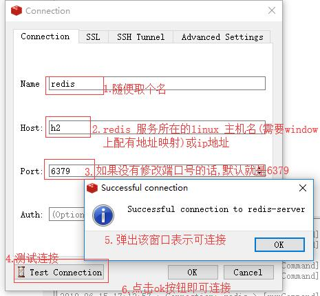
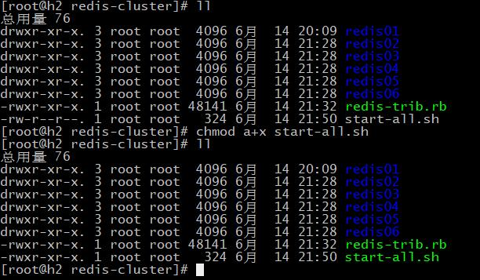

## NoSQL
#### 什么是NoSQL?
   &nbsp;&nbsp;&nbsp;&nbsp;为了解决高并发,高可扩展,高可用,大数据存储问题而产生的数据库解决方案,就是NoSQL数据库<br/>
   &nbsp;&nbsp;&nbsp;&nbsp;泛指非关系型的数据库，NoSQL即Not-Only SQL，它可以作为关系型数据库的良好补充。但是它不能替代关系型数据库，而且它是**存储在内存**中，所以它的**访问速度很快**。
   
#### Nosql的数据库分类   
  - 键值(Key-Value)存储数据库<br/>
    相关产品： Tokyo Cabinet/Tyrant、Redis、Voldemort、Berkeley DB<br/>
    典型应用： 内容缓存，主要用于处理大量数据的高访问负载。 <br/>
    数据模型： 一系列键值对<br/>
    优势： 快速查询<br/>
    劣势： 存储的数据缺少结构化<br/>
    
  - 列存储数据库<br/>
    相关产品：Cassandra, HBase, Riak<br/>
    典型应用：分布式的文件系统<br/>
    数据模型：以列簇式存储，将同一列数据存在文件系统中<br/>
    优势：查找速度快，可扩展性强，更容易进行分布式扩展<br/>
    劣势：功能相对局限<br/>
    
  - 文档型数据库<br/>
    相关产品：CouchDB、MongoDB<br/>
    典型应用：Web应用（与Key-Value类似，Value是结构化的）<br/>
    数据模型： 一系列键值对<br/>
    优势：数据结构要求不严格<br/>
    劣势： 查询性能不高，而且缺乏统一的查询语法<br/>
    
  - 图形(Graph)数据库<br/>
    相关数据库：Neo4J、InfoGrid、Infinite Graph<br/>
    典型应用：社交网络<br/>
    数据模型：图结构<br/>
    优势：利用图结构相关算法。<br/>
    劣势：需要对整个图做计算才能得出结果，不容易做分布式的集群方案<br/>
 
### Redis
  - Redis介绍<br/>
     Redis是用C语言开发的一个开源的高性能键值对（key-value）数据库。
     它通过提供多种键值数据类型来适应不同场景下的存储需求，
     目前为止Redis支持的键值数据类型如下:
       - 字符串类型
       - 散列类型
       - 列表类型
       - 集合类型
       - 有序集合类型
  - Redis发展历史<br/>
    &nbsp;&nbsp;&nbsp;&nbsp;2008年，意大利的一家创业公司Merzia推出了一款基于MySQL的网站实时统计系统LLOOGG，
    然而没过多久该公司的创始人 Salvatore Sanfilippo便对MySQL的性能感到失望，
    于是他决定亲自为LLOOGG量身定做一个数据库，并于2009年开发完成，这个数据库就是Redis。 
    不过Salvatore Sanfilippo并不满足只将Redis用于LLOOGG这一款产品，而是希望更多的人使用它，
    于是在同一年Salvatore Sanfilippo将Redis开源发布，并开始和Redis的另一名主要的
    代码贡献者Pieter Noordhuis一起继续着Redis的开发，直到今天。<br/>
    
    &nbsp;&nbsp;&nbsp;&nbsp;Salvatore Sanfilippo自己也没有想到，短短的几年时间，Redis就拥有了庞大的用户群体。
    Hacker News在2012年发布了一份数据库的使用情况调查，结果显示有近12%的公司在使用Redis。
    国内如新浪微博、街旁网、知乎网，国外如GitHub、Stack Overflow、Flickr等都是Redis的用户。<br/>
    
    &nbsp;&nbsp;&nbsp;&nbsp;VMware公司从2010年开始赞助Redis的开发， Salvatore Sanfilippo和Pieter Noordhuis也分别在3月和5月加入VMware，
    全职开发Redis。<br/>
     
  - Redis应用场景<br/>
    缓存（数据查询、短连接、新闻内容、商品内容等等）。（最多使用）<br/>
    分布式集群架构中的session分离。<br/>
    聊天室的在线好友列表。<br/>
    任务队列。（秒杀、抢购、12306等等）<br/>
    应用排行榜。<br/>
    网站访问统计。<br/>
    数据过期处理（可以精确到毫秒）<br/>
  
  - redis的特性<br/>
    1. redis数据访问速度快（数据在内存中）
    2. redis有数据持久化机制（持久化机制有两种：
        1. 定期将内存数据dump到磁盘；
        2. aof(append only file)持久化机制——用记日志的方式记录每一条数据更新操作，一旦出现灾难事件，可以通过日志重放来恢复整个数据库）
    3. redis支持集群模式（容量可以线性扩展），从3.0.0版本开始支持集群模式。
    4. redis相比其他缓存工具（ehcach/memcached），有一个鲜明的优势：支持丰富的数据结构
  
  - Redis 官网:**[http://redis.io/](http://redis.io/)**
  
  - Redis安装环境
    Redis安装一般会在Linux系统下进行安装，又因为redis是使用c语言开发，所以需要c语言环境。
     - Linux：centOS
     - C语言环境：
     
  - 安装步骤:
    1. 在Linux系统中安装c语言环境:`yum install -y gcc-c++`
    2. 将redis的源码包上传到Linux系统并解压
    3. 进入redis 安装包,然后执行make命令，编译redis的源码
       ```sbtshell
           make
       ```
    4. 安装
       ```sbtshell
           make install PREFIX=/usr/install/redis
       ```
  - 启动集群:
    - 执行cp命令将redis解压缩包中的redis.conf文件拷贝到/usr/install/redis/bin目录下
    - 修改redis.conf<br/>
        
    - 进入到redis的安装目录(/use/install/redis/)下的bin下启动redis服务:
        ```sbtshell
          ./redis-server ./redis.conf
        ```
    - 查看redis服务进程:<br/>
        
       
    - 关闭redis服务进程:<br/>
        ```sbtshell
          ./redis-cli shutdown
        ```
  - 客户端连接redis服务,测试是否能正常使用
    - 客户端连接:
        ```sbtshell
          ./redis-cli -h h2 -p 6379
          
          [root@h2 bin]# ./redis-server ./redis.conf 
          [root@h2 bin]# ./redis-cli -h h2 -p 6379   
          h2:6379> set s1 hello-redis
          OK
          h2:6379> get s1
          "hello-redis"
          h2:6379> 
        ```
    - 使用windows桌面客户端RedisDesktopManager连接测试:
        - 安装redis桌面管理工具
        - 创建连接:
            - 点击RedisDesktopManager底部的"+ Connect to Redis Server" 按钮
            - 如下配置:<br/>
                
            - 查看上面测试时存储的值:<br/>
                
                
        - 如果ip地址连接失败,在redis.conf文件中,下面位置添加下面内容,并关闭防火墙,然后重启服务<br/>
            
        
        以上是单节点Redis服务搭建.
  
### Redis集群
  - Redis架构图<br/>
    
     - 1、集群通信是通过“ping-pong”机制进行通信；
     - 2、客户端不需要将所有的节点都连接上，只需要连接其中一个节点即可。
     - 3、集群中存储数据是存储到一个个的槽中，集群中槽的个数是固定的：16384，槽的编号是【0-16383】。
          在集群中存储数据时，会根据key进行计算，计算出一个结果，然后将这个结果和16384取余，余数就是这个key将要存储的槽的编号。<br/>
         **注意：槽的编号之间不能断开。**<br/>
         槽的计算会将数据保存的很平均，不会产生一个槽满一个槽空的情况。
         
  - redis-cluster投票:容错<br/>        
    
    
     - 什么时候整个集群不可用(cluster_state:fail)? 
        1. 如果集群任意master挂掉,且当前master没有slave.
           集群进入fail状态,也可以理解成集群的slot映射[0-16383]不完成时进入fail状态
           
        2. 如果集群超过半数以上master挂掉，无论是否有slave集群进入fail状态
        
  
  - Redis集群搭建(在同一台机器上(按不同端口号来区分)).
    - 由于集群的脚本是用ruby语言编写的，所以需要准备ruby的环境
        - ruby的环境:安装ruby
            - `yum install -y ruby`
            - `yum install -y rubygems`
            
        - 安装ruby和redis的接口程序
            - 拷贝redis-3.0.0.gem到redis安装包解压目录所在的目录下<br/>
                
            - 执行： `gem install /usr/local/redis-3.0.0.gem`
                ```sbtshell
                   [root@h2 redis]# gem install redis-3.0.0.gem 
                   Successfully installed redis-3.0.0
                   1 gem installed
                   Installing ri documentation for redis-3.0.0...
                   Installing RDoc documentation for redis-3.0.0...
                   [root@h2 redis]# 
                ```
    
    - 在上面已经编译过的redis安装包目录下,将redis重新安装一份到/usr/install/目录下:
        ```sbtshell
          make install PREFIX=/usr/install/redis-cluster/redis01
        ```
    - 执行cp命令将redis解压缩包中的redis.conf拷贝到redis01的bin目录下:
        ```sbtshell
          cp redis.conf /usr/install/redis-cluster/redis01/bin
        ```
    - 需要需改redis.conf的几个地方:
        1. 设置集群模式:<br/>
            
        2. 添加当前机器的主机名(hostname)<br/>
            
        
        3. 设置后台运行模式:<br/>
            
    
    - 在复制5份redis01,分别命名为redis02,redis03,redis04,redis05,redis06
        ```sbtshell
          [root@h2 redis-cluster]# ll
          总用量 4
          drwxr-xr-x. 3 root root 4096 6月  14 20:09 redis01
          [root@h2 redis-cluster]# cp -r redis01 redis02
          [root@h2 redis-cluster]# cp -r redis01 redis03
          [root@h2 redis-cluster]# cp -r redis01 redis04
          [root@h2 redis-cluster]# cp -r redis01 redis05
          [root@h2 redis-cluster]# cp -r redis01 redis06
          [root@h2 redis-cluster]# ll
          总用量 24
          drwxr-xr-x. 3 root root 4096 6月  14 20:09 redis01
          drwxr-xr-x. 3 root root 4096 6月  14 21:28 redis02
          drwxr-xr-x. 3 root root 4096 6月  14 21:28 redis03
          drwxr-xr-x. 3 root root 4096 6月  14 21:28 redis04
          drwxr-xr-x. 3 root root 4096 6月  14 21:28 redis05
          drwxr-xr-x. 3 root root 4096 6月  14 21:28 redis06
          [root@h2 redis-cluster]# 

        ```
    - 分别修改redis01-redis06里面bin目录下的redis.conf中端口号的位置,将端口号分别修改为:<br/>
        redis01:7001<br/>
        redis02:7002<br/>
        redis03:7003<br/>
        redis04:7004<br/>
        redis05:7005<br/>
        redis06:7006<br/>
       ```sbtshell
          #同时编辑多个文件的命令 ,其中-O是水平排列,-o是垂直排列
          vim -O redis01/bin/redis.conf redis02/bin/redis.conf \
          redis03/bin/redis.conf redis04/bin/redis.conf \
          redis05/bin/redis.conf redis06/bin/redis.conf
          
          #在vim的命令行模式下,ctrl+ww进行文件切换
          # 修改完后vim命令行输入wqall全部保存退出.
       ``` 
       
       
    - 将上面redis-3.0.0的redis解压目录下的src目录下,会有一个`redis-trib.rb`文件,
        将这个文件拷贝到/usr/install/redis-cluster目录下:
        ```sbtshell
          [root@h2 src]# pwd
          /home/hadoop1/devlop_env/redis/redis-3.0.0/src
          [root@h2 src]# ll *.rb
          -rwxrwxr-x. 1 hadoop1 hadoop1 48141 4月   1 2015 redis-trib.rb
          [root@h2 src]# cp redis-trib.rb /usr/install/redis-cluster/
          [root@h2 src]# 
        ```
    - 编写启动6台redis的脚本:`vim start-all.sh`
        ```sbtshell
          #!/bin/bash
          cd redis01/bin
          ./redis-server ./redis.conf
          cd ../..
          cd redis02/bin
          ./redis-server ./redis.conf
          cd ../..
          cd redis03/bin
          ./redis-server ./redis.conf
          cd ../..
          cd redis04/bin
          ./redis-server ./redis.conf
          cd ../..
          cd redis05/bin
          ./redis-server ./redis.conf
          cd ../..
          cd redis06/bin
          ./redis-server ./redis.conf
          cd ../..
        ```
    - 修改vim start-all.sh的执行权限:`chmod a+x start-all.sh`
        
    
    - 执行start-all.sh  启动集群.<br/>
        
        
    - 上面启动的6个redis进程还是单节点模式的,需要使用redis-trib.rb 脚本来启动集群.<br/>
        执行命令:
        ```sbtshell
          ./redis-trib.rb create --replicas 1 192.168.93.112:7001  192.168.93.112:7002  192.168.93.112:7003  192.168.93.112:7004  192.168.93.112:7005  192.168.93.112:7006
        ```
        结果如下表示启动成功
        ```sbtshell
          [root@h2 redis-cluster]# ./redis-trib.rb create --replicas 1 192.168.93.112:7001  192.168.93.112:7002  192.168.93.112:7003  192.168.93.112:7004  192.168.93.112:7005  192.168.93.112:7006
          >>> Creating cluster
          Connecting to node 192.168.93.112:7001: OK
          Connecting to node 192.168.93.112:7002: OK
          Connecting to node 192.168.93.112:7003: OK
          Connecting to node 192.168.93.112:7004: OK
          Connecting to node 192.168.93.112:7005: OK
          Connecting to node 192.168.93.112:7006: OK
          >>> Performing hash slots allocation on 6 nodes...
          Using 3 masters:
          192.168.93.112:7001
          192.168.93.112:7002
          192.168.93.112:7003
          Adding replica 192.168.93.112:7004 to 192.168.93.112:7001
          Adding replica 192.168.93.112:7005 to 192.168.93.112:7002
          Adding replica 192.168.93.112:7006 to 192.168.93.112:7003
          M: bbcd975736235fc5630951ba694b3070295b6343 192.168.93.112:7001
             slots:0-5460 (5461 slots) master
          M: d5591a8bd963c955a08119f1ca02397e830ffd97 192.168.93.112:7002
             slots:5461-10922 (5462 slots) master
          M: fc2cc2b6051201bab710cfed059de46cab15989f 192.168.93.112:7003
             slots:10923-16383 (5461 slots) master
          S: ef9dddd2e9ab4b4b3926f8005554e15b960560b3 192.168.93.112:7004
             replicates bbcd975736235fc5630951ba694b3070295b6343
          S: 1b09ab2a0bebf2715fee17517f59c9b35905128c 192.168.93.112:7005
             replicates d5591a8bd963c955a08119f1ca02397e830ffd97
          S: 9b46702167cea3f656ca7e7b1cdd3faaef3a7404 192.168.93.112:7006
             replicates fc2cc2b6051201bab710cfed059de46cab15989f
          Can I set the above configuration? (type 'yes' to accept): yes
          >>> Nodes configuration updated
          >>> Assign a different config epoch to each node
          >>> Sending CLUSTER MEET messages to join the cluster
          Waiting for the cluster to join....
          >>> Performing Cluster Check (using node 192.168.93.112:7001)
          M: bbcd975736235fc5630951ba694b3070295b6343 192.168.93.112:7001
             slots:0-5460 (5461 slots) master
          M: d5591a8bd963c955a08119f1ca02397e830ffd97 192.168.93.112:7002
             slots:5461-10922 (5462 slots) master
          M: fc2cc2b6051201bab710cfed059de46cab15989f 192.168.93.112:7003
             slots:10923-16383 (5461 slots) master
          M: ef9dddd2e9ab4b4b3926f8005554e15b960560b3 192.168.93.112:7004
             slots: (0 slots) master
             replicates bbcd975736235fc5630951ba694b3070295b6343
          M: 1b09ab2a0bebf2715fee17517f59c9b35905128c 192.168.93.112:7005
             slots: (0 slots) master
             replicates d5591a8bd963c955a08119f1ca02397e830ffd97
          M: 9b46702167cea3f656ca7e7b1cdd3faaef3a7404 192.168.93.112:7006
             slots: (0 slots) master
             replicates fc2cc2b6051201bab710cfed059de46cab15989f
          [OK] All nodes agree about slots configuration.
          >>> Check for open slots...
          >>> Check slots coverage...
          [OK] All 16384 slots covered.
          
        ```
    - 在启动集群时需要注意以下几点:
        1. 在拷贝之前确保每个redis里面都没有存储过任何数据,如果有,需要先删除每个redis/bin下的dump.rdb文件
        2. 由于redis-trib.rb 对域名或主机名支持不好,故在创建集群的时候要使用ip:port的方式
        3. 如果启动时报:`call': ERR Slot 4648 is already busy (Redis::CommandError) 这样的问题,可能是
            首次启动失败导致,需要删除每个节点下面的nodes.conf,然后在重新启动redis-server,最后在创建集群.
            
    - 连接集群
        - 连接集群时,只需要连接一个节点即可:
            ```sbtshell
              ./redis-cli -h h2 -p 7001 -c #注意 -c表示连接集群.
            ```
        - 连接成功后,可查看集群信息:
            ```sbtshell
              h2:7001> cluster info
              cluster_state:ok
              cluster_slots_assigned:16384
              cluster_slots_ok:16384
              cluster_slots_pfail:0
              cluster_slots_fail:0
              cluster_known_nodes:6
              cluster_size:3
              cluster_current_epoch:6
              cluster_my_epoch:1
              cluster_stats_messages_sent:1774
              cluster_stats_messages_received:1774
              h2:7001> 

            ```
        - 往集群中存点东西测试.
            ```sbtshell
              h2:7001> set s1 hello
              -> Redirected to slot [15224] located at 192.168.93.112:7003
              OK
              192.168.93.112:7003> get s1
              "hello"
              192.168.93.112:7003> set s2 thisok
              -> Redirected to slot [2843] located at 192.168.93.112:7001
              OK
              192.168.93.112:7001> get s2
              "thisok"
              192.168.93.112:7001> 

            ```
            注意观察节点位置的变化:
            
            
### 数据类型测试

#### String:
   1. set  get
        ```sbtshell
          192.168.93.112:7001> set lv1 biyan
          -> Redirected to slot [10887] located at 192.168.93.112:7002
          OK
          192.168.93.112:7002> get lv1
          "biyan"
          192.168.93.112:7002> 

        ```
   2. 自增incr -- 值必须是整数值类型 
        ```sbtshell
           192.168.93.112:7003> set s1 0
           OK
           192.168.93.112:7003> incr s1
           (integer) 1
           192.168.93.112:7003> incr s1
           (integer) 2
           192.168.93.112:7003> incr s1
           (integer) 3
           192.168.93.112:7003> get s1
           "3"
           192.168.93.112:7003> 
        ```
   3. 自减decr -- 值必须是整数值类型
        ```sbtshell
            192.168.93.112:7003> set k2 100
            -> Redirected to slot [449] located at 192.168.93.112:7001
            OK
            192.168.93.112:7001> decr k2
            (integer) 99
            192.168.93.112:7001> decr k2
            (integer) 98
            192.168.93.112:7001> decr k2
            (integer) 97
            192.168.93.112:7001> get k2
            "97"
            192.168.93.112:7001>  
        ```
   4. 自增incrby自减decrby指定数值 -- -- 值必须是整数值类型
        ```sbtshell
          192.168.93.112:7001> set lv 100
          OK
          192.168.93.112:7001> incrby lv 200
          (integer) 300
          192.168.93.112:7001> decrby lv 120
          (integer) 180
          192.168.93.112:7001> 
        ```
   5. 同时存取多个值mset mget
       ```sbtshell
          #单节点上
          mset k1 v1 k2 v2
          
          mget k1 k2
       ```
       在集群上存储时,返回(error) CROSSSLOT Keys in request don't hash to the same slot,
       ```sbtshell
         192.168.93.112:7002> set 1 hello
         OK
         192.168.93.112:7002> set 2 world
         OK
         192.168.93.112:7002> mget 1 2
         (error) CROSSSLOT Keys in request don't hash to the same slot
         192.168.93.112:7002> set {aaa}1 hello
         OK
         192.168.93.112:7002> set {aaa}2 world
         OK
         192.168.93.112:7002> mget {aaa}1 {aaa}2
         1) "hello"
         2) "world"
         192.168.93.112:7002> 
         
       ```
       
       [查看原因](./redis3.0cluster功能介绍-邱明成-博客园.pdf)
 
   6. 使用string的问题:<br/>
   假设有User对象以JSON序列化的形式存储到Redis中，User对象有id，username、password、age、name等属性，存储的过程如下： 
   保存、更新： <br/>
   User对象  json(string)  redis 
   如果在业务上只是更新age属性，其他的属性并不做更新我应该怎么做呢？ 如果仍然采用上边的方法在传输、处理时会造成资源浪费，下边讲的hash可以很好的解决这个问题。
   
#### redis hash       
   1. 存hset m1 k1 v1   取 hget m1 k1   删除一个值 hdel m1 k1
        ```sbtshell
          192.168.93.112:7002> hset m1 k1 v1
          (integer) 0
          192.168.93.112:7002> HSET m1 k2 v2
          (integer) 1
          192.168.93.112:7002> hget m1
          (error) ERR wrong number of arguments for 'hget' command
          192.168.93.112:7002> hget m1 k1
          "v1"
          192.168.93.112:7002> hdel m1
          (error) ERR wrong number of arguments for 'hdel' command
          192.168.93.112:7002> hdel m1 k1
          (integer) 1
          192.168.93.112:7002> 
        ```
   2. 同时添加多个值hmset m1 k1 v1 k2 v2 ...<br/>
      同时查看多个值hmget m1 k1 k2 k3 ...
        ```sbtshell
          192.168.93.112:7002> hmset m1 k1 v1 k2 v2 k3 v3
          OK
          192.168.93.112:7002> hmget m1 k1 k2 k3
          1) "v1"
          2) "v2"
          3) "v3"
          192.168.93.112:7002>
        ```
   4. 增加数值
        ```sbtshell
          192.168.93.112:7002> hset m1 k1 2
          (integer) 0
          192.168.93.112:7002> hincrby m1 k1 100
          (integer) 102
          192.168.93.112:7002> 
        ```
   5. 查看是否m1中是否存在k1字段
        ```sbtshell
          192.168.93.112:7002> hexists m1 k1
          (integer) 1
          192.168.93.112:7002> hexists m1 k100
          (integer) 0
          192.168.93.112:7002> 
        ```
   6. 如果字段不存在,执行hset,如果存在,不做任何操作 hsetnx key field value
        ```sbtshell
           192.168.93.112:7002> hexists m1 k1
           (integer) 1
           192.168.93.112:7002> hexists m1 k100
           (integer) 0
           192.168.93.112:7002> hsetnx m1 k1 100
           (integer) 0
           192.168.93.112:7002> hsetnx m1 k2 100
           (integer) 0
           192.168.93.112:7002> hsetnx m1 k200 100
           (integer) 1
           192.168.93.112:7002> 
        ```
   7. 只获取key或者值
        ```sbtshell
            192.168.93.112:7002> hkeys m1
            1) "k2"
            2) "k1"
            3) "k3"
            4) "k200"
            192.168.93.112:7002> hvalues m1
            (error) ERR unknown command 'hvalues'
            192.168.93.112:7002> hvals m1
            1) "v2"
            2) "102"
            3) "v3"
            4) "100"
            192.168.93.112:7002> 
        ```
   8. 获取字段的数量:hlen m1
       ```sbtshell
            192.168.93.112:7002> hlen m1
            (integer) 4
            192.168.93.112:7002> 
       ```
   
#### List 类型
   1. 从左边存值(堆栈:先进后出(从左边来看))lpush
      ```sbtshell
         192.168.93.112:7001> lpush list5 1 2 3 4 5 6
         -> Redirected to slot [7009] located at 192.168.93.112:7002
         (integer) 6
         192.168.93.112:7002> lrange list5 0 -1
         1) "6"
         2) "5"
         3) "4"
         4) "3"
         5) "2"
         6) "1"
      ```
      
   2. 从右边存值(队列:先进先出(从左边来看是先进先出))rpush
      ```sbtshell
          192.168.93.112:7002> rpush list5 a b c d
          (integer) 10
          192.168.93.112:7002> lrange list 0 -1
          -> Redirected to slot [12291] located at 192.168.93.112:7003
           1) "6"
           2) "5"
           3) "4"
           4) "3"
           5) "2"
           6) "1"
           7) "6"
           8) "5"
           9) "4"
          10) "3"
          11) "2"
          12) "1"
          13) "a"
          14) "b"
          15) "c"
          16) "d"
          192.168.93.112:7003>
      ```
   3. 查看list:lrange list1 0 -1    <br/> 
      第一个参数表示从第几个元素开始查看,第二个参数表示查看几个元素,如果是-1表示查看之后的所有元素
      
   4. 从左(lpop)右(rpop)两端弹出:
      ```sbtshell
        192.168.93.112:7002> lpush list2 1 2 3 4 5 6
        -> Redirected to slot [11142] located at 192.168.93.112:7003
        (integer) 6
        192.168.93.112:7003> lrange list2 0 -1
        1) "6"
        2) "5"
        3) "4"
        4) "3"
        5) "2"
        6) "1"
        192.168.93.112:7003> rpop list2
        "1"
        192.168.93.112:7003> lrange list2 0 -1
        1) "6"
        2) "5"
        3) "4"
        4) "3"
        5) "2"
        192.168.93.112:7003> rpop list2
        "2"
        192.168.93.112:7003> lpop list2
        "6"
        192.168.93.112:7003> lpop list2
        "5"
        192.168.93.112:7003> lrange list2
        (error) ERR wrong number of arguments for 'lrange' command
        192.168.93.112:7003> lrange list2 0 -1
        1) "4"
        2) "3"
        192.168.93.112:7003> 

      ``` 
   5. 获取list长度 llen list2
        ```sbtshell
           192.168.93.112:7003> llen list2
           (integer) 2
           192.168.93.112:7003> llen list1
           -> Redirected to slot [7141] located at 192.168.93.112:7002
           (integer) 6
           192.168.93.112:7002> 
        ```
   6. 删除列表中指定的元素<br/>
        - lrem key count value<br/>
        lrem 命令会删除列表中前count个值值为value的元素,返回实际删除元素的个数.<br/>
        根据count值得不同,该命令的执行方式会有不同.
            - 当count值>0时,lrem会从列表的左边开始删除
               ```sbtshell
                  192.168.93.112:7001> lrem ls 1 hello
                  (integer) 1
                  192.168.93.112:7001> lrange ls 0 -1
                  1) "is"
                  2) "this"
                  3) "hao"
                  4) "ni"
                  5) "world"
                  6) "hello"
                  192.168.93.112:7001> 
               ```
            - 当count值<0时,lrem会从列表的右边开始删除
                ```sbtshell
                   192.168.93.112:7001> lrange ls 0 -1
                   1) "good"
                   2) "is"
                   3) "this"
                   4) "hao"
                   5) "ni"
                   6) "world"
                   7) "hello"
                   8) "hello"
                   192.168.93.112:7001> lrem ls -1 1
                   (integer) 0
                   192.168.93.112:7001> lrem ls -1 good
                   (integer) 1
                   192.168.93.112:7001> lrange ls 0 -1
                   1) "is"
                   2) "this"
                   3) "hao"
                   4) "ni"
                   5) "world"
                   6) "hello"
                   7) "hello"
                   192.168.93.112:7001> 
                              
                ```
            - 当count值=0时,lrem会从删除列表中所有的value值
                ```sbtshell
                  192.168.93.112:7001> lrem ls 0 hao
                  (integer) 1
                  192.168.93.112:7001> lrange ls 0 -1
                  1) "is"
                  2) "this"
                  3) "ni"
                  4) "world"
                  5) "hello"
                ```
#### set类型,数据有序且不重复
   1. 添加(sadd)元素并查看(smembers)元素
        ```sbtshell
           192.168.93.112:7001> sadd set2 1 2 3 3 4 5 5
           -> Redirected to slot [15294] located at 192.168.93.112:7003
           (integer) 5
           192.168.93.112:7003> smembers set2
           1) "1"
           2) "2"
           3) "3"
           4) "4"
           5) "5"
           192.168.93.112:7003> 
        ```  
   2. 删除元素srem k1 value (移除值为value的元素)
        ```sbtshell
          192.168.93.112:7003> srem set2 3   #移除值为3的元素
          (integer) 1   #移除一个
          192.168.93.112:7003> smembers set2
          1) "1"
          2) "2"
          3) "4"
          4) "5"
          192.168.93.112:7003> srem set2 3  #再次移除3这个元素
          (integer) 0 #已经没有3这个元素了,移除结果为0
          192.168.93.112:7003> 
        ```
   3. 判断元素是否存在
        ```sbtshell
          192.168.93.112:7003> sismember set2 3
          (integer) 0
          192.168.93.112:7003> sismember set2 1
          (integer) 1
          192.168.93.112:7003> 
        ```  
   
##### 运算命令:
   1. 运算差集
        ```sbtshell
          127.0.0.1:6379> sadd set3 2 3 4
          (integer) 3
          127.0.0.1:6379> sadd set4 1 2 3
          (integer) 3
          127.0.0.1:6379> sdiff set4 set3
          1) "1"
          127.0.0.1:6379> sdiff set3 set4
          1) "4"
        ```
   2. 交集运算:
        ```sbtshell
          127.0.0.1:6379> sinter set3 set4
          1) "2"
          2) "3"
        ```
   3. 并集运算:
        ```sbtshell
          127.0.0.1:6379> sunion set3 set4
          1) "1"
          2) "2"
          3) "3"
          4) "4"
        ```
   4. 注意,以上命令在集群中,如果两个set不在同一个节点,运行时报错:
        ```sbtshell
          192.168.93.112:7002> sinter set3 set4
          (error) CROSSSLOT Keys in request don't hash to the same slot
          192.168.93.112:7002>
        ```

#### Sortedset类型
   - 在设置时,回个一个分数,通过分数,可以进行排序
   1. 添加元素,并查看排名
        ```sbtshell
          192.168.93.112:7002> zadd zset1 1 hahaha 2 hehehe 0 ooooo
          -> Redirected to slot [4341] located at 192.168.93.112:7001
          (integer) 3
          192.168.93.112:7001> zrange zset1 0 -1
          1) "ooooo"
          2) "hahaha"
          3) "hehehe"
          192.168.93.112:7001> 
        ```
   2. 删除元素:
        ```sbtshell
          192.168.93.112:7001> zrange zset1 0 -1
          1) "ooooo"
          2) "hahaha"
          3) "hehehe"
          192.168.93.112:7001> zrem zset1 ooooo
          (integer) 1
          192.168.93.112:7001> zrange zset1 0 -1
          1) "hahaha"
          2) "hehehe"
          192.168.93.112:7001> 

        ```
   3. 查看某范围内的排名:
        ```sbtshell
          192.168.93.112:7002> zrange zset 0 -1
          1) "heihei"
          2) "hello"
          3) "world"
          4) "nihao"
          5) "wotoo"
          192.168.93.112:7002> zrange zset 0 3
          1) "heihei"
          2) "hello"
          3) "world"
          4) "nihao"
          192.168.93.112:7002> 
        ```  
   4. 查看某分数范围内的元素
        ```sbtshell
          192.168.93.112:7002> zrangebyscore zset 3 4
          1) "nihao"
          2) "wotoo"
          192.168.93.112:7002>
        ``` 
   5. 增加某个元素的分数,返回的是更改后的分数
        ```sbtshell
          192.168.93.112:7002> zincrby zset 10 nihao
          "13"
          192.168.93.112:7002> 
        ```
   6. 获取元素的个数
        ```sbtshell
          192.168.93.112:7002> zcard zset 
          (integer) 5
          192.168.93.112:7002> 
        ```
   7. 获取指定分数范围内的元素
        ```sbtshell
              192.168.93.112:7002> zcount zset 2 3
              (integer) 0
              192.168.93.112:7002> zcount zset 2 4
              (integer) 1
              192.168.93.112:7002> 
        ```
   8. 按照排名范围删除元素
        ```sbtshell
          192.168.93.112:7002> zremrangebyrank zset 0 2
          (integer) 3
          192.168.93.112:7002> zmembers zset
          (error) ERR unknown command 'zmembers'
          192.168.93.112:7002> zcard zset
          (integer) 2
          192.168.93.112:7002> 
        ```  
  
     
     
     
     
     
     
     
     
     
     
     
     
     
     
     
     
     
     
     
     
     
     
     
     
            
        
   